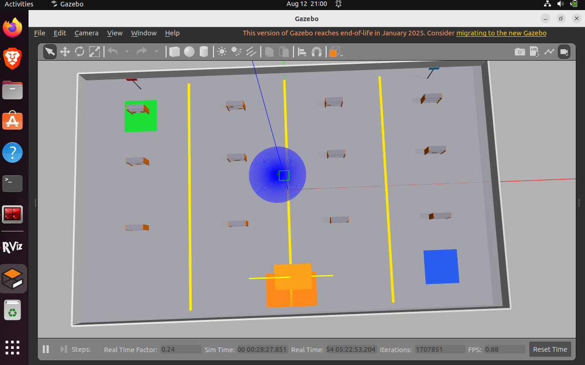
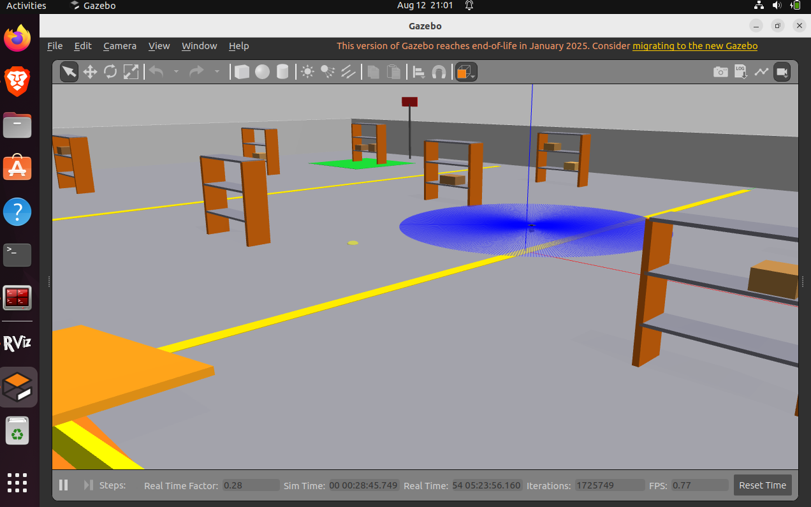
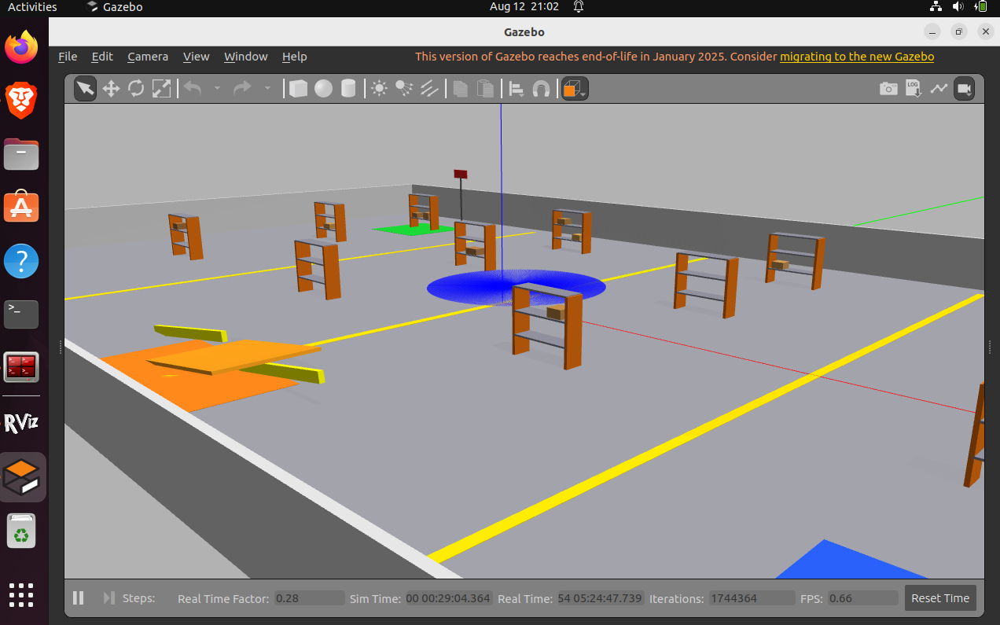
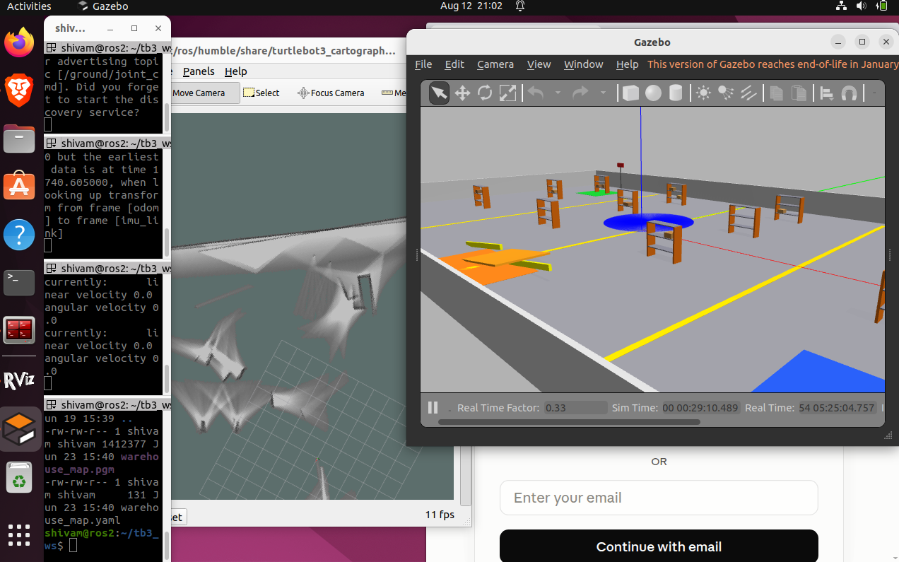
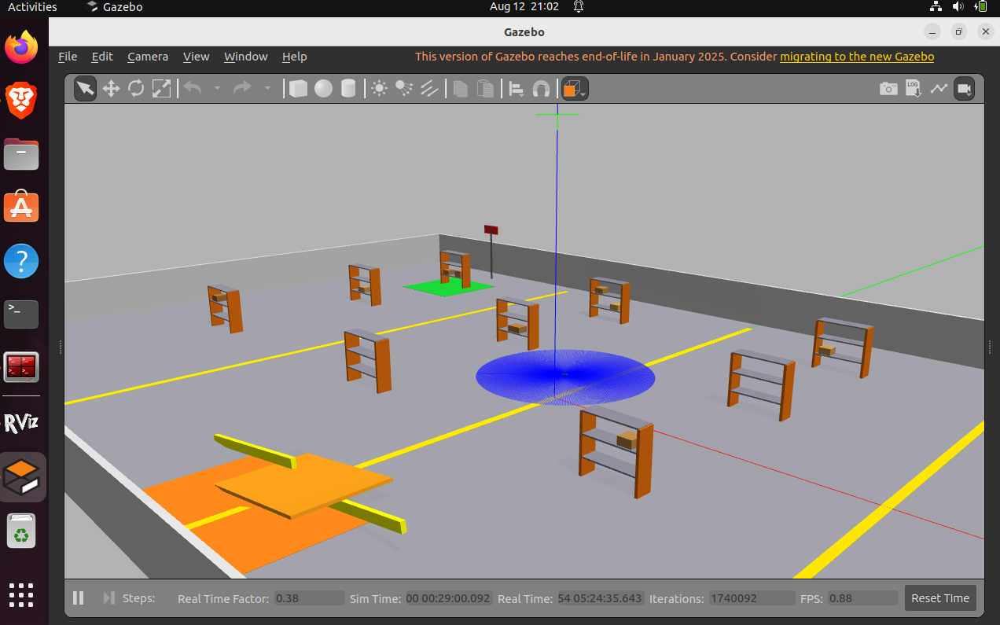

# Warehouse Robots

A ROS 2 workspace for warehouse robotics and multi-robot swarm control — combining navigation, robot description, simulation, and a lightweight Python-based swarm coordination package.

## Overview

This workspace brings together everything needed to model, simulate, and coordinate robots operating in a warehouse environment: mobile manipulator descriptions, navigation configuration, simulation support, and a swarm controller for coordinating multiple robots.

## Repository Structure

```
warehouse-robots/
├── images/                              # Diagrams and screenshots used in docs
│   └── .gitkeep
├── src/
│   ├── warehouse_nav/                   # Navigation package
│   │   ├── CMakeLists.txt
│   │   └── package.xml
│   │
│   ├── warehouse_robot_description/     # Robot URDF/Xacro descriptions
│   │   ├── urdf/
│   │   │   ├── arm.urdf.xacro
│   │   │   └── mobile_manipulator.urdf.xacro
│   │   ├── CMakeLists.txt
│   │   └── package.xml
│   │
│   ├── warehouse_simulation/            # Simulation support
│   │   ├── CMakeLists.txt
│   │   └── package.xml
│   │
│   └── warehouse_swarm/                 # Swarm controller (Python package)
│       ├── warehouse_swarm/
│       │   ├── __init__.py
│       │   ├── cli.py                   # Command-line entry point
│       │   ├── core.py                  # Swarm controller logic
│       │   └── utils.py                 # Shared utility functions
│       ├── resource/
│       │   └── warehouse_swarm
│       ├── tests/
│       │   ├── test_copyright.py
│       │   ├── test_core.py
│       │   ├── test_flake8.py
│       │   ├── test_pep257.py
│       │   └── test_utils.py
│       ├── package.xml
│       ├── setup.cfg
│       └── setup.py
│
├── .gitignore
└── README.md
```

## Packages

| Package | Description |
|---|---|
| `warehouse_nav` | Navigation stack configuration for warehouse robots. |
| `warehouse_robot_description` | URDF/Xacro models for the robot arm and mobile manipulator. |
| `warehouse_simulation` | Simulation environment and support files. |
| `warehouse_swarm` | Python package implementing a simple swarm controller and shared utilities, with a CLI entry point and full test suite. |

## Prerequisites

- ROS 2 (Humble or newer recommended)
- Python 3.10+
- `colcon` build tools

```bash
sudo apt install python3-colcon-common-extensions
```

## Getting Started

### 1. Clone the repository

```bash
git clone <your-repo-url> warehouse-robots
cd warehouse-robots
```

### 2. Install dependencies

```bash
rosdep install --from-paths src --ignore-src -r -y
```

### 3. Build the workspace

```bash
colcon build
```

### 4. Source the workspace

```bash
source install/setup.bash
```

### 5. Run the tests

```bash
colcon test
colcon test-result --verbose
```

## Using the Warehouse Swarm Package

`warehouse_swarm` provides a simple swarm controller and utility functions for coordinating multiple warehouse robots, along with a CLI entry point defined in `cli.py`.

Once built and sourced, run it via:

```bash
ros2 run warehouse_swarm cli
```

*(Update this command to match the actual entry point name defined in `setup.py`.)*

### Running the swarm package's own tests

```bash
colcon test --packages-select warehouse_swarm
```

## Robot Description

The `warehouse_robot_description` package holds the Xacro/URDF definitions for the robot:

- `arm.urdf.xacro` — manipulator arm model
- `mobile_manipulator.urdf.xacro` — full mobile manipulator (base + arm)

These can be visualized with `robot_state_publisher` and `rviz2`, or loaded into a simulator via `warehouse_simulation`.

## Images

Simulation screenshots from Gazebo, showing the warehouse environment, shelving layout, and robot navigation/SLAM in action.

| Preview | Description |
|---|---|
|  | Top-down view of the warehouse floor with shelving racks, aisle markings, and the robot's local costmap/footprint visible at the center. |
|  | Angled view of the shelving aisles and pickup/drop-off zones (green and orange marked areas). |
|  | Another perspective of the warehouse layout, showing shelf spacing and the robot's sensor sweep. |
|  | ROS 2 terminal output alongside Gazebo, showing a Cartographer SLAM session building the map (`use_map.pgm` / `use_map.yaml`) from the TurtleBot3 workspace. |
|  | Full warehouse simulation view with shelves, navigation zones, and the robot positioned at the center aisle intersection. |

To use them, save the five images into the `images/` folder using the filenames above (`Warehouse1.png` … `Warehouse5.png`), then commit them along with this README so the links resolve on GitHub.

### Adding more images

1. Drop the image file into the `images/` folder (e.g. `images/my_diagram.png`).
2. Reference it anywhere in this README using standard Markdown syntax:

```markdown

```

3. Commit both the image and the README change together so links stay valid.

This keeps diagrams versioned alongside the code and ensures they render correctly on GitHub.

## Development Workflow

- Build only a specific package: `colcon build --packages-select <package_name>`
- Rebuild after changes: `colcon build --symlink-install` (useful for Python packages like `warehouse_swarm` to avoid rebuilding on every edit)
- Lint checks (`flake8`, `pep257`) and copyright checks are included in the `warehouse_swarm` test suite and run automatically with `colcon test`.

## Contributing

1. Create a feature branch.
2. Make your changes, keeping each package's tests passing.
3. Run `colcon test` before opening a pull request.
4. Submit a pull request with a clear description of the change.

## License

Add your chosen license here (e.g., Apache-2.0, MIT) and include a corresponding `LICENSE` file at the workspace root.
